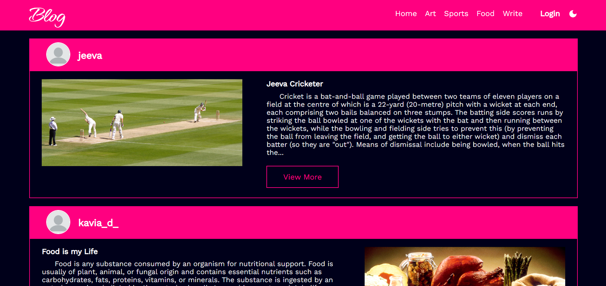

# Blog App

This repo contains the project about <b>Blog App</b>. The frontend made of Reactjs Framework and the backend is all Nodejs. Database used in this project is mysql.

## Features

    1. Responsive design
    2. Authentication using jwt
    3. Interactive user interface
    4. Different theme
    5. Like feature

### Register Page


### Login Page


### Home Page



### Single Page or Like Page


## Build Using

    - Reactjs
    - Nodejs
    - Express
    - Axios
    - jwt
    - Styled-components
    - mysql2
    - multer
    - bcrypt
    - cookies
    - react-toastify
    - mui
    - react-router-dom

## Getting Started

- ### **Prerequisites**

  - [React js](https://react.dev/)
  - [mysql](https://www.mysql.com/)
  - [Nodejs](https://nodejs.org/en)

- ### Clone

  Clone the Project

  ```
  $ git clone https://github.com/Aravindhraj007/blog-app.git
  ```

- ### **Installation**

  Install the dependencies

  - Frontend

    ```
    $ cd client
    $ yarn
    ```

  - Backend
    ```
    $ cd server
    $ npm install
    ```

- ### Run

  Run the frontend

  ```
  $ yarn dev
  ```

  Run the backend

  ```
  $ npm start
  ```
